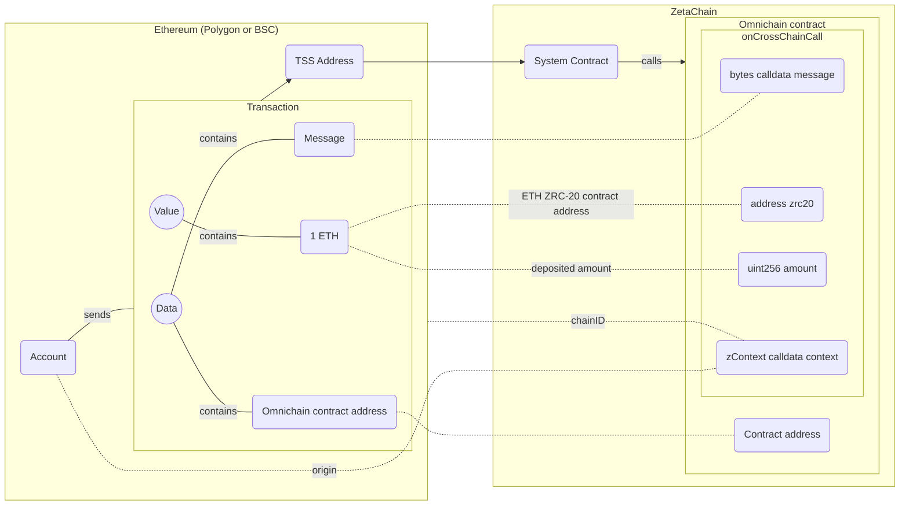

# Overview

Omnichain Smart Contracts are contracts deployed on ZetaChain that can use and
orchestrate assets on connected chains, as well as on ZetaChain. With omnichain
smart contracts you are able to have a single place of logic that can maintain
the state of assets and data across all connected chains.



For a contract to be considered omnichain it must inherit from the `zContract`
interface and implement the `onCrossChainCall` function:

```solidity
pragma solidity 0.8.7;

import "@zetachain/protocol-contracts/contracts/zevm/interfaces/IZRC20.sol";
import "@zetachain/protocol-contracts/contracts/zevm/interfaces/zContract.sol";

contract YourContract is zContract {
    function onCrossChainCall(
        zContext calldata context,
        address zrc20,
        uint256 amount,
        bytes calldata message
    ) external virtual override {
        bytes32 recipient = abi.decode(message, (bytes32));

        (, uint256 gasFee) = IZRC20(zrc20).withdrawGasFee();

        IZRC20(zrc20).approve(zrc20, gasFee);
        IZRC20(zrc20).withdraw(abi.encodePacked(recipient), amount - gasFee);
    }
}
```

The contract above is a very simple example of an omnichain contract. Check out
the [introductory omnichain tutorial](/developers/omnichain/tutorials/hello) for
a more in-depth example.

An omnichain contract is deployed on ZetaChain and can be called from any
connected chain.

To call on omnichain contract the only thing a user has to do is send a
transaction to a connected chain to ZetaChain's TSS address. The transaction
`amount` becomes available to the sender on ZetaChain as
[ZRC-20](/developers/tokens/zrc20) and the `data` byte array (containing an the
omnichain contract `address` and `message`) is used to call the omnichain
contract by `address` and pass arguments from the `message`.

Omnichain Smart Contracts are ideal for more complex applications where state
management between different chains is core to the application. Some use case
examples include:

- Complex trading or DeFi applications that involve liquidity on multiple
  chains.
- Adding smart contract layer to non-smart-contract chains like Bitcoin and
  Dogecoin, or incorporating these chains/assets with other pieces of the DeFi
  ecosystem natively.
- Multichain smart-contract wallet applications like portfolio management across
  all chains.
- Leveraging existing implementations of protocols like Aave, Uniswap, Curve,
  etc. for omnichain. Since zEVM is EVM-compatible, one can build on top of
  these implementations (just as they would on Ethereum) to adapt them for
  omnichain interoperability.
