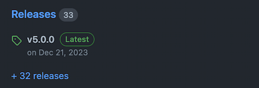

# Making a Release

To make a release click on the "Releases" link on right side of the page.

Then click on the "Draft a new release" button.

A release form will appear.

ZetaChain follows [semantic versioning](https://semver.org/). The version number
should be in the format `MAJOR.MINOR.PATCH`. For example, `1.0.0`. The version
number should be incremented based on the following logic.

If the release does not contain breaking changes and it's safe for users'
package manager to apply the update automatically, increment the `PATCH` number.

If the release doesn't contain breaking changes and you think it's best for
users to manually apply the update, increment the `MINOR` number.

In any other scenario, increment the `MAJOR` number.

Sometimes you may want to add a pre-release version. For example, `1.0.0-rc1`.
This is useful when you want to release a version for testing purposes before
making it generally available. Pre-release versions are not installed unless a
user explicitly specifies the version number, so it's generally safe to publish
a pre-release version. Pre-release versions may be published from branches other
than `main` (like feature branches). Please, use the same naming convention for
pre-release versions: `-rc1`, `-rc2`, etc.

1. Click "Choose a tag" and enter a new version name. The version name should be
   prefixed with `v`. For example, `v1.0.0`.
2. Select the target branch (for regular releases it must be `main`, for
   pre-release it may be any branch).
3. Click "Generate release notes" to generate release notes based on the commits
   since the last release. Generally, it's sufficient to use the default
   generated release notes, but you can edit them if necessary.
4. If you're making a pre-release (like `-rc1`), check the "Set as a
   pre-release" checkbox.
5. Click "Publish release" to publish the release or "Save draft" to save the
   release as a draft.

It's not a bad idea to save a draft of the release first and reaching to someone
else in the core team to get a confirmation before publishing the release.

You **do not need to update the `package.json` file manually**. The version
number will be set automatically by the release workflow.

After the release is published, GitHub will automatically run a workflow that
will build the project and make a new release on npm. Please, make sure that the
workflow succeeds in the "Actions" tab.
