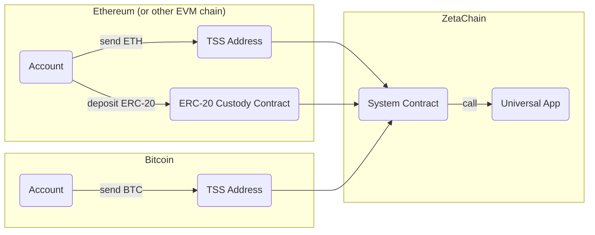

import { Alert } from "~/components/shared";

# Building Universal Apps

A universal app is an EVM-compatible smart contract deployed on ZetaChain's
universal EVM. These apps can interact seamlessly with multiple blockchains,
including Ethereum and Bitcoin.

Below is a simple example of a universal app written in Solidity:

```solidity
// SPDX-License-Identifier: MIT
pragma solidity 0.8.7;

import "@zetachain/toolkit/contracts/ZetaChain.sol";

contract MyContract is ZetaChain {
    constructor() ZetaChain() {}

    function onCrossChainCall(
        zContext calldata context,
        address zrc20,
        uint256 amount,
        bytes calldata message
    ) external override onlySystem {
        // TODO: implement the logic
    }
}
```

A universal app can receive contract calls from users on connected chains such
as Ethereum and Bitcoin. Each contract call may include a message and tokens,
including both native gas tokens and supported ERC-20 tokens. When a universal
app receives a contract call, the `onCrossChainCall` method is triggered. This
method takes the following parameters:

* Context: Contains the chain ID of the connected chain from which the universal
  app was called, as well as the address of the original user.
* ZRC-20: Represents the address of the token transferred to the universal app.
* Amount: The amount of tokens transferred.
* Message: Contains arbitrary message data.

The following diagram illustrates the workflow of a universal app, showing how
it interacts with various blockchains:



To call a universal app and transfer native gas tokens, make a token transfer to
a TSS address on a connected chain. The first 20 bytes of the input data of the
transaction should contain the universal app's address, followed by the message.

The TSS address is a ZetaChain's address that holds custody of the tokens
transferred to universal apps. TSS address is owned collectively by a network of
observer-signer validators acting on behalf of the ZetaChain protocol.

To call a universal app and transfer supported ERC-20 tokens, call the `deposit`
method of the ERC-20 custody contract. The `recipient` is the universal app
contract address.

<Alert> Transferring ERC-20 ZETA is different from other tokens. To transfer
ERC-20 ZETA tokens to and from universal apps, use the [Connector
API](./connector).</Alert>

When tokens are transferred to the TSS address or ERC-20 custody contract on a
connected chain, the original tokens get locked, and ZRC-20 versions of the same
assets are minted on ZetaChain and transferred to the universal app.

ZRC-20 is an extended version of ERC-20 that supports withdrawing tokens back to
their original chain. All native gas tokens and supported ERC-20s are
represented as ZRC-20 on ZetaChain's universal EVM.

For example, when ETH is sent to the TSS address on Ethereum with the first 20
bytes of input data containing a contract address, the same amount of ZRC-20 ETH
is sent to a universal app contract.

ZRC-20 tokens can be sent back to their original chain by calling the `withdraw`
method.

In summary, a universal app on ZetaChain is an EVM-compatible smart contract
capable of interacting with multiple blockchains like Ethereum and Bitcoin.
These apps can receive tokens and messages from users on connected chains,
triggering the onCrossChainCall method. Tokens transferred to universal apps are
converted to ZRC-20 tokens, an extended version of ERC-20 that supports
cross-chain transactions. This enables seamless interoperability and
functionality across different blockchain ecosystems.