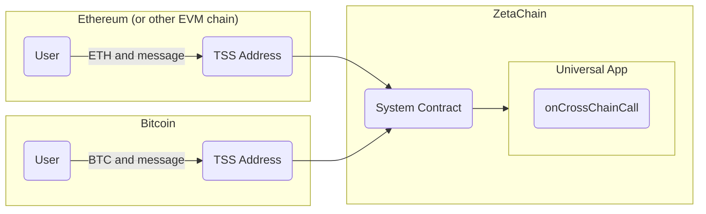
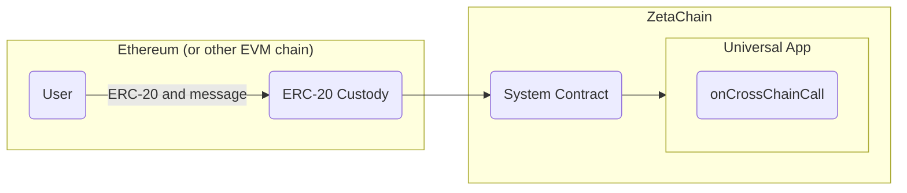
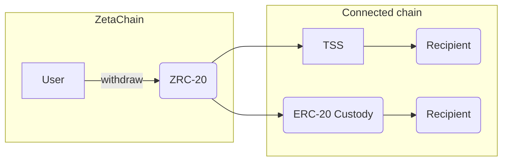
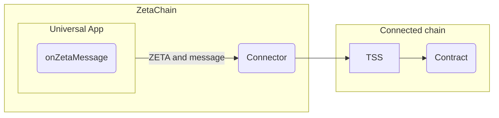
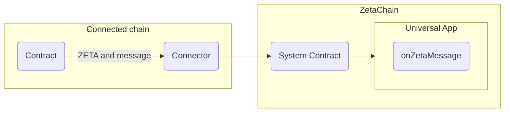

import { Alert } from "~/components/shared";

## Overview

A universal app is a smart contract on ZetaChain that is natively connected to
other blockchains like Ethereum, BNB and Bitcoin.

Unlike a regular contract, a universal app can accept contract calls, messages
and token transfers from any connected chain. It can also trigger contract
calls, and make token transfers on connected chains. These abilities enable
universal apps to orchestrate complex multi-step transactions that span across
chains.

For example, a Bitcoin user can interact with a universal app to send USDC to a
recipient on Ethereum. An Ethereum user can buy an NFT on ZetaChain and send it
to to their account on the BNB chain.

Here's an example universal app:

```solidity
pragma solidity 0.8.7;

import "@zetachain/protocol-contracts/contracts/zevm/interfaces/zContract.sol";

contract YourContract is zContract {
    function onCrossChainCall(
        zContext calldata context,
        address zrc20,
        uint256 amount,
        bytes calldata message
    ) external virtual override {
        // ...
    }
}
```

A key advantage of a universal app is that it requires deploying only a single
contract on ZetaChain, eliminating the need for separate contracts on each
connected chain.

## Calling a Universal App

To call a universal app and transfer native gas tokens from a connected chain, a
user makes a token transfer transaction to a special address called TSS.



To call a universal app and transfer supported ERC-20 tokens from a connected
chain, a user calls the `deposit` method of the ERC-20 custody contract.



Calling a universal app executes the `onCrossChainCall` method.

The message is passed as the `bytes calldata message` argument and can contain
arbitrary data.

Native gas or supported ERC-20 tokens get locked in the TSS address or ERC-20
custody contract on connected chain. `onCrossChainCall` receives representations
of these tokens called [ZRC-20](/developers/tokens/zrc20). For example, if you
make a call with 1 ETH on Ethereum, a universal app will receive 1 ZRC-20 ETH.

Advantages:

- Bitcoin support
- Sending messages to a TSS address is cheaper than general message passing
- Does not require deploying contracts on connected chains. For example, a user
  on Ethereum can call a universal app by sending ETH and a message to a TSS
  address.

Limitations:

- ERC-20 custody contract accepts only supported tokens.
- Messages can only be sent to universal apps, not from them.

## Withdrawing ZRC-20 Tokens

Native gas and tokens ERC-20 tokens transferred to a universal app are
represented as ZRC-20 tokens. ZRC-20 extends ERC-20 with a `withdraw` method.



Call the `withdraw` method to send ZRC-20 tokens back to the chain from which
they originate. The withdrawer must have sufficient tokens to cover the
[withdraw fee](/developers/evm/gas).

## Sending Messages to/from a Universal App

To send a message to or from a universal app you can also use a connector API.
Connector is an API that offers two features:

- General message passing to and from universal apps
- Transfer of ZETA tokens to and from universal apps





Advantages:

- Messages can be sent to and from universal apps
- Messages can be sent between messaging contracts on connected chains. For
  example, a messaging contract on Ethereum can send a message to a contract on
  BNB chain.

Limitations:

- Contracts need to be deployed on connected chains to receive and send messages

## Summary

- Universal apps are contracts deployed on ZetaChain's EVM that can accept
  contract calls, messages and token transfers from connected chains.
- Universal apps can contract calls, and make token transfers on connected
  chains.
- A universal app can be implemented as a single contract on ZetaChain. You
  don't need to have contracts on all connected chains.
- You can use the connector API for general message passing to and from
  universal apps.
