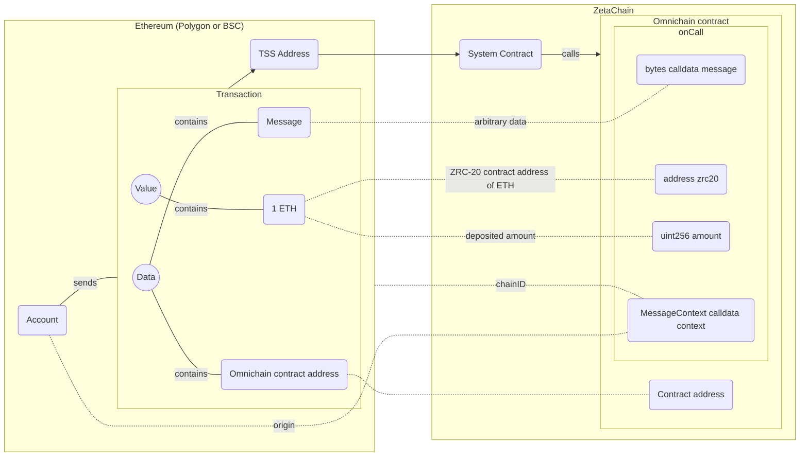

import { ChainConfirmations, ForeignCoinsTable } from "~/components/Docs";

ZRC-20 is a token standard integrated into ZetaChain's omnichain smart contract
platform. With ZRC-20, developers can build dApps that orchestrate native assets
on any connected chain. This makes building Omnichain DeFi protocols and dApps
such as Omnichain DEXs, Omnichain Lending, Omnichain Portfolio Management, and
anything else that involves fungible tokens on multiple chains from a single
place extremely simple — as if they were all on a single chain.

## Summary

Native gas tokens of connected blockchains and whitelisted ERC-20 tokens can be
deposited to ZetaChain as ZRC-20 tokens. During the deposit process, the
native/ERC-20 tokens are transferred to and locked in the TSS address/ERC-20
custody contract and ZRC-20 tokens are minted on ZetaChain and deposited to the
recipient address.

ZRC-20 tokens can be withdrawn from ZetaChain to connected blockchains. During
the withdrawal process, ZRC-20 tokens are burnt on ZetaChain and native/ERC-20
tokens are transferred to the recipient address on the connected chain from a
TSS address/ERC-20 custody contract.

ZRC-20 tokens can only be minted by the ZetaChain protocol. An ERC-20 token
deployed on ZetaChain does not have the properties of ZRC-20 and can't be
withdrawn from ZetaChain to a connected chain.

The "same" ERC-20 token from two connected blockchains is represented as two
different ZRC-20 tokens on ZetaChain. For example, USDT from Ethereum is
represented as ZRC-20 USDT from Ethereum, and USDT from BSC is represented as
ZRC-20 USDT from BSC. They are not considered the same asset by ZetaChain, but
they can be swapped. That's how the transfer of the "same" ERC-20 asset can be
implemented on ZetaChain: by depositing an ERC-20 (chain A), swapping this
ZRC-20 (chain A) to an ZRC-20 (chain B), and withdrawing the ZRC-20 (chain B) to
chain B as ERC-20.

## Supported Assets

A list of currently supported assets:

<ForeignCoinsTable />

New assets can be added or removed by broadcasting a transaction with a
corresponding message of the [`fungible`
module](/developers/architecture/modules/fungible/messages/) on ZetaChain.

## Introduction

At a high-level, ZRC-20 tokens are an extension of the standard
[ERC-20](https://ethereum.org/en/developers/docs/standards/tokens/erc-20/)
tokens found in the Ethereum ecosystem, ZRC-20 tokens have the added ability to
manage assets on all ZetaChain-connected chains. Any fungible token, including
Bitcoin, ETH, other gas assets and ERC-20-equivalents on other chains, may be
represented on ZetaChain as a ZRC-20 and orchestrated as if it were any other
fungible token (like an ERC-20).

## Interface

ZRC-20 is based on ERC-20, with three additional functions and some associated
events for integration with Cross-Chain Transactions (CCTXs) in ZetaChain (see
the [`IZRC20`
interface](https://github.com/zeta-chain/protocol-contracts/blob/main/contracts/zevm/interfaces/IZRC20.sol)).

Comparing ZRC-20 to ERC-20, there are additional external functions to deposit
and withdraw, and additional events for each of them. This makes ZRC-20
completely compatible with any applications built for ERC-20s, but with an
extremely simple interface to also function in an omnichain way.

## Depositing Native Gas Tokens as ZRC-20

To deposit a native gas token (like sETH, tMATIC, tBNB, or tBTC) to ZetaChain,
send it to the [TSS address](/reference/network/contracts) on a connected chain.

If the input data field of the transaction is empty, the token will be deposited
to the sender's address on ZetaChain.

If the input data field is not empty, the protocol looks up the first 20 bytes
of the input data field. If the first 20 bytes correspond to an EOA address on
ZetaChain, the token will be deposited to that address. If the first 20 bytes
correspond to a contract address on ZetaChain, the token will be deposited to
that contract and the `onCall` function of that contract will be called with the
remaining input data as the `message`.

When depositing native gas tokens from EVM-based connected chains, there is no
additional cross-chain fee. If you send 1 token to a TSS address, you will
receive 1 ZRC-20 version of the same token on ZetaChain.

For Bitcoin deposits, which utilize the UTXO (Unspent Transaction Output) model,
the process [incurs additional fees](/developers/chains/bitcoin#deposit-fee).

## Block Confirmations

When depositing to or withdrawing from ZetaChain, the protocol requires a
certain number of confirmations on the connected chain before the transaction is
considered final. The number of confirmations required is different for each
chain. You can check the number of confirmations in the table below:

<ChainConfirmations />

These values are stored in the state of ZetaChain and are used by ZetaClient
(the program that observer-signer validators run) as recommended values of
confirmations. In some cases ZetaClient can use a higher number of
confirmations, for example, when the value transfer exceeds a specified amount.

## Liquidity Cap

Each ZRC-20 has a total cap on the number of deposited tokens that the protocol
can accept. Any assets beyond this deposited to ZetaChain from connected chains
will be returned to the sender. You can view the caps on the explorer
[here](https://explorer.zetachain.com/liquidity).
