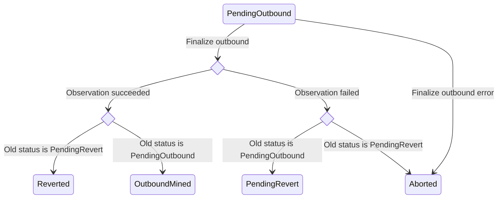
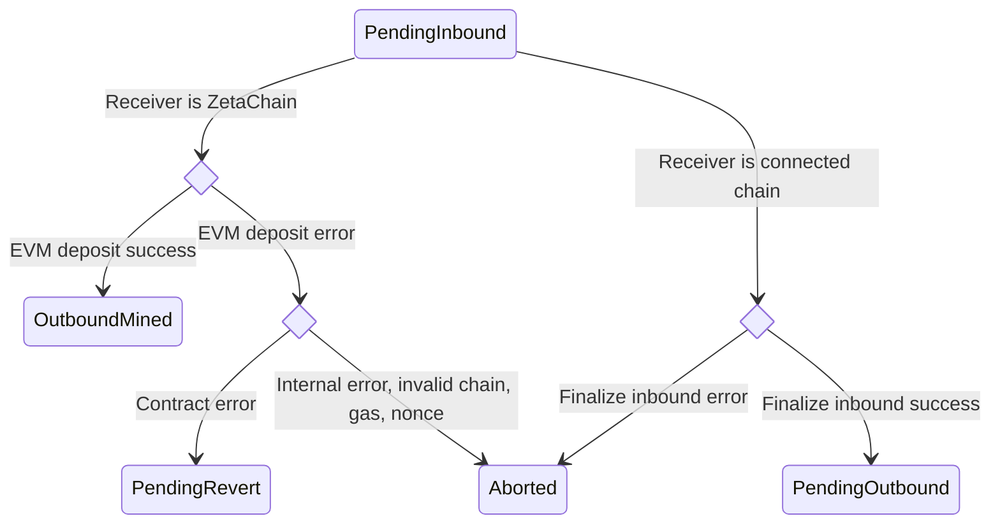

## authority

### 消息（Messages）

#### MsgUpdatePolicies

`UpdatePolicies` 用于更新策略。

```proto
message MsgUpdatePolicies {
	string creator = 1;
	Policies policies = 2;
}
```

#### MsgUpdateChainInfo

`UpdateChainInfo` 用于更新链信息对象。
当提供的链在链信息对象中不存在时会新增；若已存在则更新。

```proto
message MsgUpdateChainInfo {
	string creator = 1;
	pkg.chains.Chain chain = 3;
}
```

#### MsgRemoveChainInfo

`RemoveChainInfo` 会移除指定链 ID 的链信息。

```proto
message MsgRemoveChainInfo {
	string creator = 1;
	int64 chain_id = 2;
}
```

#### MsgAddAuthorization

`AddAuthorization` 用于新增授权。如果授权已存在，将以提供的策略覆盖。
该消息应由管理员策略账户调用。

```proto
message MsgAddAuthorization {
	string creator = 1;
	string msg_url = 2;
	PolicyType authorized_policy = 3;
}
```

#### MsgRemoveAuthorization

`RemoveAuthorization` 会从列表中移除授权，应由管理员策略账户调用。

```proto
message MsgRemoveAuthorization {
	string creator = 1;
	string msg_url = 2;
}
```

## crosschain

### 概述

`crosschain` 模块负责跟踪跨链交易（CCTX）的入站与出站流程。

与该模块交互的主要参与者是观察者验证者（Observers）。观察者运行链下程序 `zetaclient`，监听连接链上的入站交易、ZetaChain 上待处理的出站交易，以及连接链上的出站交易。

在观察到入站或出站交易后，观察者会参与投票流程。

#### 投票

当观察者为某笔交易提交投票时，会创建一个 `ballot`（若此前不存在）。观察者可以对该投票单投票。当投票数量达到 `BallotThreshold` 时，投票单即视为“已完成”。

将投票单推进到“已完成”状态的最后一票会触发跨链交易执行并支付相关 Gas 成本。

投票单完成后提交的投票会被丢弃。

#### 入站交易

入站交易指在连接链上观察到的跨链交易。观察者通过广播 `MsgVoteInbound` 对入站交易进行投票。

将投票单推进到“已完成”状态的最后一票会触发跨链交易执行。

若目标链是 ZetaChain 且 CCTX 不包含消息，则会将 ZRC-20 代币存入 ZetaChain 上的账户。

若目标链是 ZetaChain 且 CCTX 包含消息，则会存入 ZRC-20 代币并在 ZetaChain 上调用合约。合约地址与参数由消息提供。

若目标链不是 ZetaChain，则会将交易状态更新为 “pending outbound”，并按出站交易流程处理该 CCTX。

#### 出站交易

###### Pending Outbound

观察者会在 ZetaChain 上监听待处理的出站交易。为处理此类交易，观察者需要参与 TSS 密钥签名（keysign）流程，完成签名后将签名交易广播至连接链。

###### Observed Outbound

观察者会在连接链上监控已广播的出站交易。一旦交易在连接链上“确认”（或“被打包”），观察者会向 ZetaChain 发送 `VoteOutbound` 消息进行投票。

当投票超过阈值后，投票流程完成，交易状态更新为最终状态。

#### 权限

| Message                  | 管理策略账户 | 观察者验证者 |
| ------------------------ | ------------ | ------------ |
| MsgVoteTSS               |              | ✅           |
| MsgGasPriceVoter         |              | ✅           |
| MsgVoteOutbound          |              | ✅           |
| MsgVoteInbound           |              | ✅           |
| MsgAddOutboundTracker    | ✅           | ✅           |
| MsgRemoveOutboundTracker | ✅           |              |

#### 状态

模块在状态中存储以下信息：

- 出站交易列表
- 链的 nonce 列表
- 链的最新高度列表
- 跨链交易列表
- 入站交易与跨链交易之间的映射
- TSS 密钥
- 观察者提交的连接链 Gas 价格

### 消息（Messages）

#### MsgAddOutboundTracker

`AddOutboundTracker` 在出站交易跟踪器中新增记录。仅管理员策略账户与观察者验证者可在无需证明情况下广播该消息。如果找不到待处理的 CCTX，而该链 ID 与 nonce 已存在记录，则会移除该跟踪器。

```proto
message MsgAddOutboundTracker {
	string creator = 1;
	int64 chain_id = 2;
	uint64 nonce = 3;
	string tx_hash = 4;
	pkg.proofs.Proof proof = 5;
	string block_hash = 6;
	int64 tx_index = 7;
}
```

#### MsgAddInboundTracker

`AddInboundTracker` 会在入站交易跟踪器中新增记录。

```proto
message MsgAddInboundTracker {
	string creator = 1;
	int64 chain_id = 2;
	string tx_hash = 3;
	pkg.coin.CoinType coin_type = 4;
	pkg.proofs.Proof proof = 5;
	string block_hash = 6;
	int64 tx_index = 7;
}
```

#### MsgRemoveInboundTracker

`RemoveInboundTracker` 会在存在时移除入站跟踪器。

```proto
message MsgRemoveInboundTracker {
	string creator = 1;
	int64 chain_id = 2;
	string tx_hash = 3;
}
```

#### MsgRemoveOutboundTracker

`RemoveOutboundTracker` 会按链 ID 与 nonce 移除出站交易跟踪器中的记录。
授权：管理员策略第 1 组。

```proto
message MsgRemoveOutboundTracker {
	string creator = 1;
	int64 chain_id = 2;
	uint64 nonce = 3;
}
```

#### MsgVoteGasPrice

`VoteGasPrice` 提交指定区块高度的连接链 Gas 价格信息。每位验证者提交的价格会单独记录，并更新中位数索引。

仅观察者验证者可广播此消息。

```proto
message MsgVoteGasPrice {
	string creator = 1;
	int64 chain_id = 2;
	uint64 price = 3;
	uint64 priority_fee = 6;
	uint64 block_number = 4;
	string supply = 5;
}
```

#### MsgVoteOutbound

`VoteOutbound` 为在连接链上已广播并确认的出站交易投票。若这是首个投票，会创建新的投票单；当投票达到阈值时，投票单完成并处理出站交易。

若观测成功，将铸造等量于 `burned` 与 `minted` 差值的 ZETA，并存入模块账户。

若观测失败，则根据之前的状态处理：

- 若之前状态为 `PendingOutbound`，将创建新的回退交易。为支付回退交易费用，会用 CCTX 携带的代币在 ZetaChain 上的 Uniswap V2 合约中兑换目标链的 ZRC-20 Gas 代币，然后销毁。更新 nonce，若成功则状态改为 `PendingRevert`。
- 若之前状态为 `PendingRevert`，则 CCTX 作废。



仅观察者验证者可广播此消息。

```proto
message MsgVoteOutbound {
	string creator = 1;
	string cctx_hash = 2;
	string observed_outbound_hash = 3;
	uint64 observed_outbound_block_height = 4;
	uint64 observed_outbound_gas_used = 10;
	string observed_outbound_effective_gas_price = 11;
	uint64 observed_outbound_effective_gas_limit = 12;
	string value_received = 5;
	pkg.chains.ReceiveStatus status = 6;
	int64 outbound_chain = 7;
	uint64 outbound_tss_nonce = 8;
	pkg.coin.CoinType coin_type = 9;
	ConfirmationMode confirmation_mode = 13;
}
```

#### MsgVoteInbound

`VoteInbound` 为在连接链上观察到的入站交易投票。若为首个投票，会创建新的投票单；当投票达到阈值时，投票单完成并创建新的 CCTX。

若接收链为 ZetaChain，则调用 `HandleEVMDeposit`。若存入的是 ZETA，则调用 `MintZetaToEVMAccount` 将代币铸造至接收账户；若是连接链的 Gas 代币或 ERC-20，则调用 ZRC-20 的 `deposit`，并在消息非空时调用系统合约的 `depositAndCall` 执行 ZetaChain 上的全链合约。若成功，CCTX 状态更新为 `OutboundMined`。

若接收链为连接链，则调用 `FinalizeInbound` 以准备将 CCTX 作为出站交易处理。为支付出站交易费用，会用 CCTX 携带代币在 ZetaChain 上的 Uniswap V2 合约中兑换目标链的 ZRC-20 Gas 代币并销毁。更新 nonce，若成功则状态改为 `PendingOutbound`。



仅观察者验证者可广播此消息。

```proto
message MsgVoteInbound {
	string creator = 1;
	string sender = 2;
	int64 sender_chain_id = 3;
	string receiver = 4;
	int64 receiver_chain = 5;
	string amount = 6;
	string message = 8;
	string inbound_hash = 9;
	uint64 inbound_block_height = 10;
	uint64 gas_limit = 11;
	pkg.coin.CoinType coin_type = 12;
	string tx_origin = 13;
	string asset = 14;
	uint64 event_index = 15;
	ProtocolContractVersion protocol_contract_version = 16;
	RevertOptions revert_options = 17;
	CallOptions call_options = 18;
	bool is_cross_chain_call = 19;
	InboundStatus status = 20;
	ConfirmationMode confirmation_mode = 21;
}
```

#### MsgWhitelistERC20

`WhitelistERC20` 会部署新的 ZRC-20、创建外部代币对象，并发起跨链交易在外部链上将该 ERC-20 加入白名单。
授权：管理员策略第 1 组。

```proto
message MsgWhitelistERC20 {
	string creator = 1;
	string erc20_address = 2;
	int64 chain_id = 3;
	string name = 4;
	string symbol = 5;
	uint32 decimals = 6;
	int64 gas_limit = 7;
	string liquidity_cap = 8;
}
```

#### MsgUpdateTssAddress

`UpdateTssAddress` 用于更新 TSS 地址。

```proto
message MsgUpdateTssAddress {
	string creator = 1;
	string tss_pubkey = 2;
}
```

#### MsgMigrateTssFunds

`MigrateTssFunds` 将资金从当前 TSS 迁移至新 TSS。

```proto
message MsgMigrateTssFunds {
	string creator = 1;
	int64 chain_id = 2;
	string amount = 3;
}
```

#### MsgAbortStuckCCTX

`AbortStuckCCTX` 用于终止卡住的 CCTX。授权：管理员策略第 2 组。

```proto
message MsgAbortStuckCCTX {
	string creator = 1;
	string cctx_index = 2;
}
```

#### MsgRefundAbortedCCTX

`RefundAbortedCCTX` 用于为已终止的 CCTX 退款。它会验证 CCTX 是否已终止且尚未退款，并检查退款地址有效性，然后将金额退还给退款地址，并将 CCTX 标记为已退款。相关退款地址与金额逻辑可参考文档中的 `GetRefundAddress` 与 `GetAbortedAmount`。

```proto
message MsgRefundAbortedCCTX {
	string creator = 1;
	string cctx_index = 2;
	string refund_address = 3;
}
```

#### MsgUpdateRateLimiterFlags

`UpdateRateLimiterFlags` 更新速率限制器标志。授权：管理员策略（运维）。

```proto
message MsgUpdateRateLimiterFlags {
	string creator = 1;
	RateLimiterFlags rate_limiter_flags = 2;
}
```

#### MsgMigrateERC20CustodyFunds

`MigrateERC20CustodyFunds` 将资金从当前 ERC20Custody 合约迁移到新合约。

```proto
message MsgMigrateERC20CustodyFunds {
	string creator = 1;
	int64 chain_id = 2;
	string new_custody_address = 3;
	string erc20_address = 4;
	string amount = 5;
}
```

#### MsgUpdateERC20CustodyPauseStatus

`UpdateERC20CustodyPauseStatus` 会创建管理员命令 CCTX，以更新 ERC20Custody 合约的暂停状态。

```proto
message MsgUpdateERC20CustodyPauseStatus {
	string creator = 1;
	int64 chain_id = 2;
	bool pause = 3;
}
```

## emissions

### 概述

`emissions` 模块负责协调观察者、验证者与 TSS 签名者的奖励分配。目前仅在每个区块向验证者分发奖励，未分配的观察者与 TSS 奖励会存于各自池中。

奖励分发逻辑在 begin blocker 中实现。

模块会记录用于计算奖励的参数：

- 最大质押因子
- 最小质押因子
- 平均出块时间
- 目标质押比例
- 验证者奖励比例
- 观察者奖励比例
- TSS 签名者奖励比例
- 持续时间因子常数

### 消息（Messages）

#### MsgUpdateParams

`UpdateParams` 定义了通过治理更新 `x/emissions` 模块参数的操作。
权限账户固定为 `x/gov` 模块账户。

```proto
message MsgUpdateParams {
	string authority = 1;
	Params params = 2;
}
```

#### MsgWithdrawEmission

`WithdrawEmission` 允许用户提取可提取的排放奖励。成功提取后，会将未分发奖励池中的金额转入用户账户。
若请求金额大于可提取余额，则会提取最大可用金额；若池内余额不足以满足请求，则返回错误。

```proto
message MsgWithdrawEmission {
	string creator = 1;
	string amount = 2;
}
```

## fungible

### 概述

`fungible` 模块用于在 ZetaChain 上部署连接链（外部链）中的同质化代币（称为 “foreign coins”）。

外部代币会在 ZetaChain 上表示为 ZRC-20 代币。

当在 ZetaChain 上部署外部代币时，会部署 ZRC-20 合约、创建流动性池、为池子注入流动性，并将该代币添加到模块状态中的外部代币列表。

模块包含以下逻辑：

- 在 ZetaChain 上部署外部代币
- 部署系统合约、Uniswap 与包装 ZETA
- 从连接链向 ZetaChain 的全链智能合约存入并调用（`DepositZRC20AndCallContract` 与 `DepositZRC20`）

该模块高度依赖[协议合约](https://github.com/zeta-chain/protocol-contracts)。

#### 状态

`fungible` 模块会跟踪以下状态：

- 系统合约地址
- 外部代币列表

### 消息（Messages）

#### MsgDeploySystemContracts

`DeploySystemContracts` 用于部署新的系统合约实例。
授权：管理员策略第 2 组。

```proto
message MsgDeploySystemContracts {
	string creator = 1;
}
```

#### MsgDeployFungibleCoinZRC20

`DeployFungibleCoinZRC20` 会将连接链上的同质化代币以 ZRC-20 形式部署到 ZetaChain。

若该代币为 Gas 代币，将执行以下操作：

* 部署该代币的 ZRC-20 合约；
* 在系统合约中设置 ZRC-20 合约地址为代币地址；
* 铸造 ZETA 并存入模块账户；
* 在系统合约上调用 `setGasZetaPool` 记录池信息；
* 调用 `addLiquidityETH` 向池子添加流动性。

若该代币非 Gas 代币：

* 部署 ZRC-20 合约；
* 将该代币加入模块状态的外部代币列表。

授权：管理员策略第 2 组。

```proto
message MsgDeployFungibleCoinZRC20 {
	string creator = 1;
	string ERC20 = 2;
	int64 foreign_chain_id = 3;
	uint32 decimals = 4;
	string name = 5;
	string symbol = 6;
	pkg.coin.CoinType coin_type = 7;
	int64 gas_limit = 8;
	string liquidity_cap = 9;
}
```

#### MsgRemoveForeignCoin

`RemoveForeignCoin` 会从模块状态的外部代币列表中移除某个代币。
授权：管理员策略第 2 组。

```proto
message MsgRemoveForeignCoin {
	string creator = 1;
	string zrc20_address = 2;
}
```

#### MsgUpdateSystemContract

`UpdateSystemContract` 用于更新系统合约。

```proto
message MsgUpdateSystemContract {
	string creator = 1;
	string new_system_contract_address = 2;
}
```

#### MsgUpdateContractBytecode

`UpdateContractBytecode` 用于将合约的字节码更新为现有合约的字节码。仅 ZRC-20 合约或 WZeta 连接器合约可更新。
重要：新合约字节码必须与旧合约保持相同的存储布局；可以新增变量，但不能移除已有变量。
授权：管理员策略第 2 组。

```proto
message MsgUpdateContractBytecode {
	string creator = 1;
	string contract_address = 2;
	string new_code_hash = 3;
}
```

#### MsgUpdateZRC20WithdrawFee

`UpdateZRC20WithdrawFee` 用于更新 ZRC-20 代币的提现费用与 Gas 上限。

```proto
message MsgUpdateZRC20WithdrawFee {
	string creator = 1;
	string zrc20_address = 2;
	string new_withdraw_fee = 6;
	string new_gas_limit = 7;
}
```

#### MsgUpdateZRC20LiquidityCap

`UpdateZRC20LiquidityCap` 用于更新 ZRC-20 代币的流动性上限。
授权：管理员策略第 2 组。

```proto
message MsgUpdateZRC20LiquidityCap {
	string creator = 1;
	string zrc20_address = 2;
	string liquidity_cap = 3;
}
```

#### MsgPauseZRC20

`PauseZRC20` 可暂停一组 ZRC-20 代币。
授权：管理员策略 `groupEmergency`。

```proto
message MsgPauseZRC20 {
	string creator = 1;
	string zrc20_addresses = 2;
}
```

#### MsgUnpauseZRC20

`UnpauseZRC20` 恢复 ZRC-20 代币的运行。
授权：管理员策略 `groupOperational`。

```proto
message MsgUnpauseZRC20 {
	string creator = 1;
	string zrc20_addresses = 2;
}
```

#### MsgUpdateGatewayContract

`UpdateGatewayContract` 更新 ZetaChain 协议用于读取入站、处理出站的 zevm 网关合约。

```proto
message MsgUpdateGatewayContract {
	string creator = 1;
	string new_gateway_contract_address = 2;
}
```

#### MsgUpdateZRC20Name

`UpdateZRC20Name` 更新 ZRC-20 代币的名称和/或符号。

```proto
message MsgUpdateZRC20Name {
	string creator = 1;
	string zrc20_address = 2;
	string name = 3;
	string symbol = 4;
}
```

#### MsgBurnFungibleModuleAsset

`BurnFungibleModuleAsset` 会销毁 `fungible` 模块上的 ZRC-20 余额。若提供零地址，则会销毁 `fungible` 模块持有的原生 ZETA。

```proto
message MsgBurnFungibleModuleAsset {
	string creator = 1;
	string zrc20_address = 2;
}
```

#### MsgUpdateGatewayGasLimit

`UpdateGatewayGasLimit` 更新 ZetaChain 协议使用的网关 Gas 上限。

```proto
message MsgUpdateGatewayGasLimit {
	string creator = 1;
	uint64 new_gas_limit = 2;
}
```

## lightclient

### 消息（Messages）

#### MsgEnableHeaderVerification

`EnableHeaderVerification` 为指定链 ID 启用区块头验证标志。启用后可提交区块头并用于校验证明正确性。

```proto
message MsgEnableHeaderVerification {
	string creator = 1;
	int64 chain_id_list = 2;
}
```

#### MsgDisableHeaderVerification

`DisableHeaderVerification` 为指定链 ID 禁用区块头验证标志。禁用后无法提交区块头或用其校验证明。

```proto
message MsgDisableHeaderVerification {
	string creator = 1;
	int64 chain_id_list = 2;
}
```

## observer

### 概述

`observer` 模块维护用于投票的投票单、链与观察者账户的映射、受支持的连接链列表、核心参数（合约地址、出站交易调度间隔等）、观察者参数（投票阈值、最低观察者委托等）以及管理员策略参数。

投票单用于为入站与出站交易投票。`observer` 模块提供投票单的创建、读取、更新、删除（CRUD）能力，并提供辅助函数判断投票单是否完成。投票机制也为其他模块所用，例如观察者验证者在 `crosschain` 模块中对交易进行投票。

观察者验证者是在 `zetacored`（区块链节点）旁运行 `zetaclient` 的验证者，获授权对跨链交易的入站与出站进行投票。

链与观察者账户之间的映射目前在创世阶段设定，并在 `crosschain` 模块中用于判断某观察者验证者是否有权对特定链的交易进行投票。

### 消息（Messages）

#### MsgAddObserver

`AddObserver` 将观察者地址加入观察者集合。

```proto
message MsgAddObserver {
	string creator = 1;
	string observer_address = 2;
	string zetaclient_grantee_pubkey = 3;
	bool add_node_account_only = 4;
}
```

#### MsgUpdateObserver

`UpdateObserver` 用于更新观察者地址。
授权：管理员策略（管理员更新）或旧观察者地址（当观察者因违规被记墓碑时）。

```proto
message MsgUpdateObserver {
	string creator = 1;
	string old_observer_address = 2;
	string new_observer_address = 3;
	ObserverUpdateReason update_reason = 4;
}
```

#### MsgUpdateChainParams

`UpdateChainParams` 更新特定链的参数，或新增一条链。链参数包括确认次数、出站交易调度间隔、ZETA 代币、连接器与 ERC20 托管合约地址等。
仅管理员策略账户可广播。

```proto
message MsgUpdateChainParams {
	string creator = 1;
	ChainParams chainParams = 2;
}
```

#### MsgRemoveChainParams

`RemoveChainParams` 会移除某条链的参数。

```proto
message MsgRemoveChainParams {
	string creator = 1;
	int64 chain_id = 2;
}
```

#### MsgVoteBlame

```proto
message MsgVoteBlame {
	string creator = 1;
	int64 chain_id = 2;
	Blame blame_info = 3;
}
```

#### MsgUpdateKeygen

`UpdateKeygen` 更新密钥生成所在的区块高度，并将状态设置为“pending keygen”。
授权：管理员策略第 1 组。

```proto
message MsgUpdateKeygen {
	string creator = 1;
	int64 block = 2;
}
```

#### MsgVoteBlockHeader

`VoteBlockHeader` 为新区块头投票，以便存储。

```proto
message MsgVoteBlockHeader {
	string creator = 1;
	int64 chain_id = 2;
	bytes block_hash = 3;
	int64 height = 4;
	pkg.proofs.HeaderData header = 5;
}
```

#### MsgResetChainNonces

`ResetChainNonces` 处理链 nonce 的重置。

```proto
message MsgResetChainNonces {
	string creator = 1;
	int64 chain_id = 2;
	int64 chain_nonce_low = 3;
	int64 chain_nonce_high = 4;
}
```

#### MsgVoteTSS

`VoteTSS` 就创建 TSS 密钥并记录其信息（公钥、参与者与运营者地址、完成与 keygen 高度）进行投票。

当投票通过时，会在链上记录 TSS 密钥信息，并将 keygen 状态设为 “success”。

若 keygen 不存在、已完成或已失败，则投票会失败。

仅节点账户可广播该消息。

```proto
message MsgVoteTSS {
	string creator = 1;
	string tss_pubkey = 2;
	int64 keygen_zeta_height = 3;
	pkg.chains.ReceiveStatus status = 4;
}
```

#### MsgEnableCCTX

`EnableCCTX` 启用 `IsInboundEnabled` 与 `IsOutboundEnabled` 标志，这两个标志用于控制入站与出站的创建。由具备 `groupOperational` 策略类型的策略账户启用。

```proto
message MsgEnableCCTX {
	string creator = 1;
	bool enableInbound = 2;
	bool enableOutbound = 3;
}
```

#### MsgDisableCCTX

`DisableCCTX` 禁用 `IsInboundEnabled` 与 `IsOutboundEnabled` 标志。由具备 `groupEmergency` 策略类型的策略账户禁用。

```proto
message MsgDisableCCTX {
	string creator = 1;
	bool disableInbound = 2;
	bool disableOutbound = 3;
}
```

#### MsgDisableFastConfirmation

`DisableFastConfirmation` 为指定链 ID 禁用快速确认。被禁用的链仅使用安全确认次数（SAFE confirmation count）来确认入站与出站。

```proto
message MsgDisableFastConfirmation {
	string creator = 1;
	int64 chain_id = 2;
}
```

#### MsgUpdateGasPriceIncreaseFlags

`UpdateGasPriceIncreaseFlags` 更新 GasPriceIncreaseFlags，这些标志用于控制 Gas 价格上调。由具备 `groupOperational` 策略类型的策略账户更新。

```proto
message MsgUpdateGasPriceIncreaseFlags {
	string creator = 1;
	GasPriceIncreaseFlags gasPriceIncreaseFlags = 2;
}
```

#### MsgUpdateOperationalFlags

```proto
message MsgUpdateOperationalFlags {
	string creator = 1;
	OperationalFlags operational_flags = 2;
}
```

#### MsgUpdateOperationalChainParams

`UpdateOperationalChainParams` 更新与运维相关的链参数。与 `MsgUpdateChainParams` 不同，该消息不会修改敏感参数，例如用于监听连接链的网关合约地址。

```proto
message MsgUpdateOperationalChainParams {
	string creator = 1;
	int64 chain_id = 2;
	uint64 gas_price_ticker = 3;
	uint64 inbound_ticker = 4;
	uint64 outbound_ticker = 5;
	uint64 watch_utxo_ticker = 6;
	int64 outbound_schedule_interval = 7;
	int64 outbound_schedule_lookahead = 8;
	ConfirmationParams confirmation_params = 9;
	bool disable_tss_block_scan = 10;
}
```

